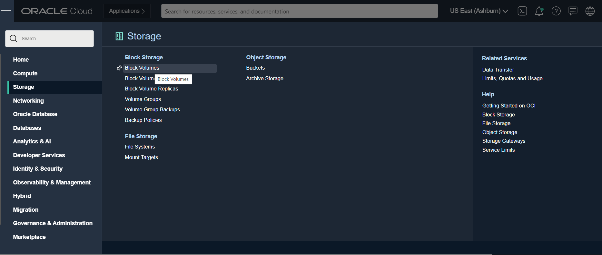
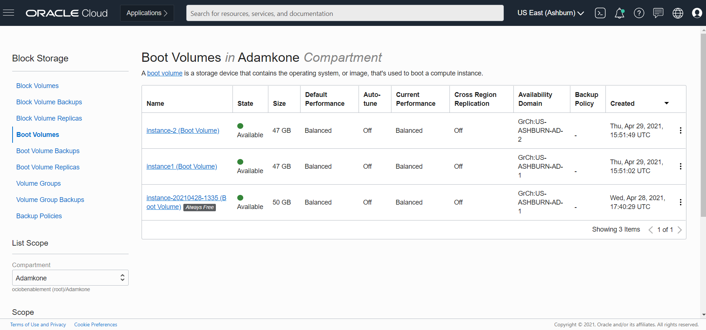
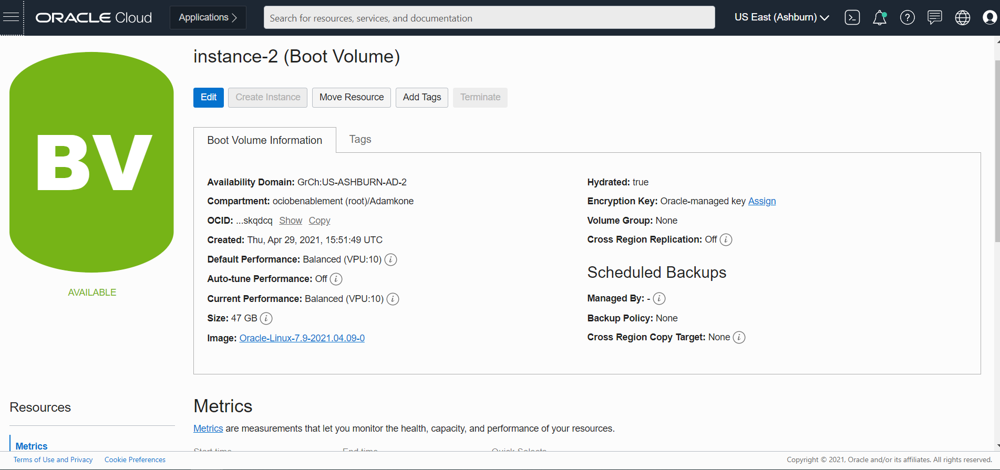
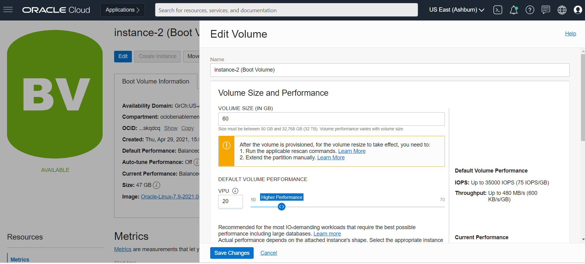
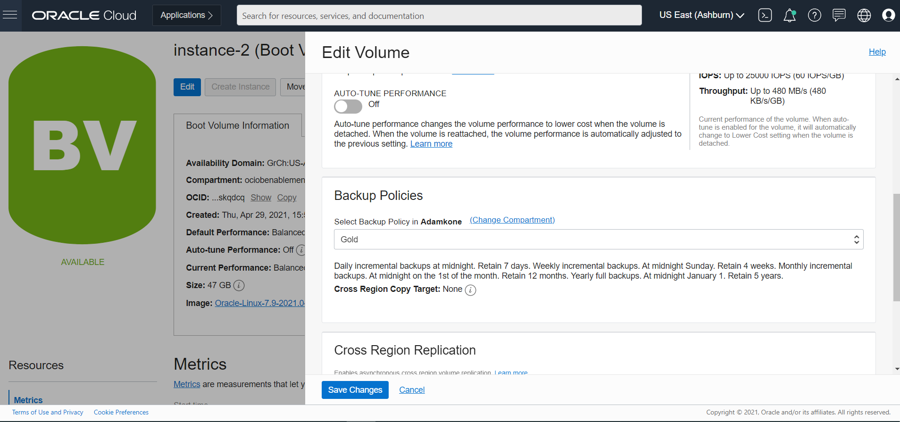
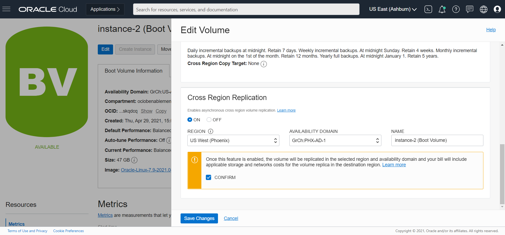

# LiveLabs Complete Template

*About this template: This file is used to demonstrate all of the features built into the LiveLabs conversion engine. Many of the features described here are optional and are so marked. Start with  and then follow it with .*

## Introduction

*To get started with this lag you will need an Oracle account, the boot volume you want to replicate accross region .

*You may add an option video, using this format: *

  

Estimated Lab Time: 3 minutes

### Background
Enter background information here - this can include product information, or a technology overview, but also should cover what the workshop is about.

### Objectives

*List objectives for the lab - if this is the intro lab, list objectives for the workshop*

In this lab, you will:
* learn how to enanle cross region replication manually 

### Prerequisites

*Use this section to describe any prerequisites, including Oracle Cloud accounts, set up requirements, etc.*

* An Oracle Cloud Account and sign in
* You will need to have the permission required to perform this task 
* An instance with boot volume 

*Note: If you have a **Free Trial** account, when your Free Trial expires your account will be converted to an **Always Free** account. You will not be able to conduct Free Tier workshops unless the Always Free environment is available. **[Click here for the Free Tier FAQ page.](https://www.oracle.com/cloud/free/faq.html)***

*This is the "fold" - below items are collapsed by default*

## **Step 1**: enable cross-region replication 

<!-- Images -->

1. On the oci dashboard  click on menu  

    

2. Select storage then block volume
     
     

    

3. Select boot volumes 

      

4. Select the boot volume that you want to backup in the list
       
  
5. In the boot volume information cross Region copy Target:none that mean the backup is not enabled

    

6. Click on edit

     
     
     

    - Name it   sample:webserver_01bv
    - Provide a size
    - Provide the vpu
    - You can turn on if you desire  the feature AUTO-TUNE PERFORMANCE
    - Make sure to select you compartment
    - Choose the backup policies base on your company requirement 
    - Turn on the cross replication 
    - Select the region where you want your replication to happen
    - Select the Availability Domain
    - You check the confirm check box
    - Save changes

7. You can also automate this task but that is not the scoope of this labs 

## Learn More

*(optional - include links to docs, white papers, blogs, etc)*

* [URL text 1](http://docs.oracle.com)
* [URL text 2](http://docs.oracle.com)

## Acknowledgements
* **Author** - <Name, Title, Group>
* **Contributors** -  <Name, Group> -- optional
* **Last Updated By/Date** - <Name, Group, Month Year>
* **Workshop (or Lab) Expiry Date** - <Month Year> -- optional, use this when you are using a Pre-Authorized Request (PAR) URL to an object in Oracle Object Store.
